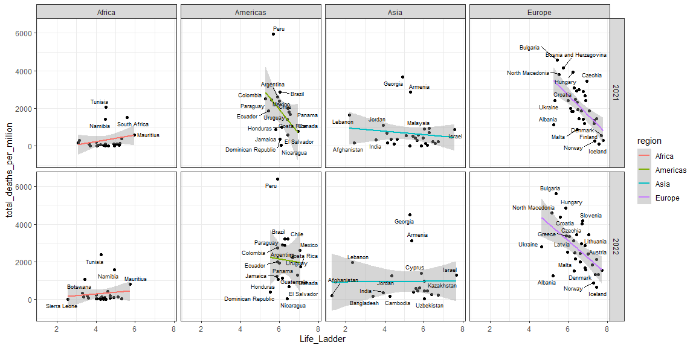
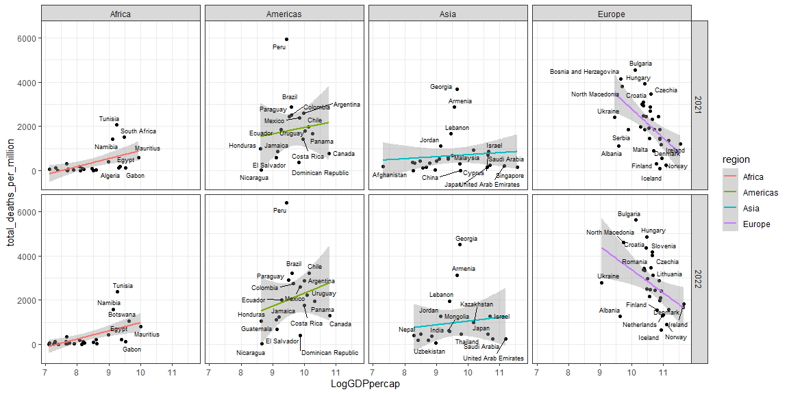
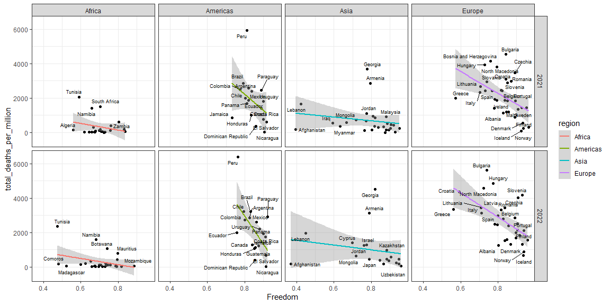
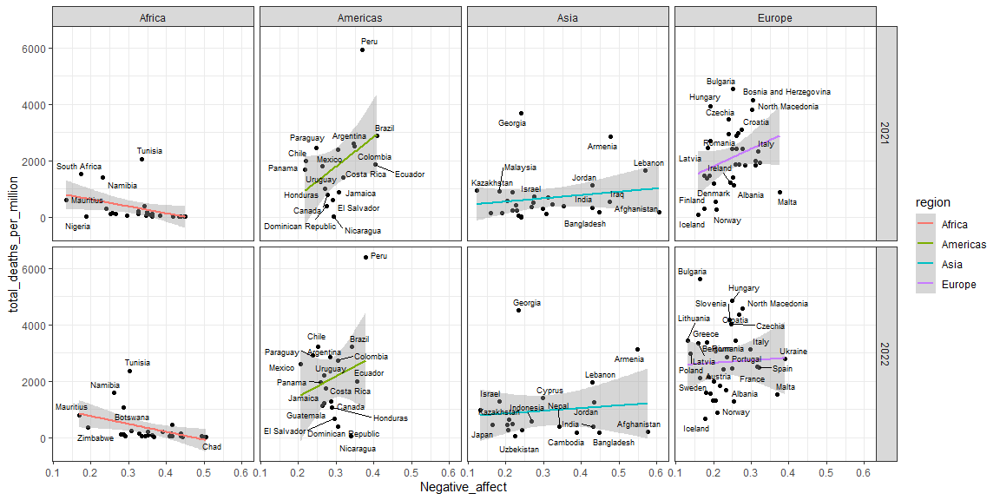

```r
# Import datasets

# Read xls of the happiness report data from 2005 to 2022
# Temporary file
temp_excel <- tempfile()
# Download using downloader package
download("https://happiness-report.s3.amazonaws.com/2023/DataForTable2.1WHR2023.xls?raw=true",
         dest = temp_excel, # Save temp file
         mode = "wb")
# Read xls from temp file
happiness <- read_excel(temp_excel)

# Read csv of the ISO 3166 Countries with Regional Codes (taken from Luke Duncalfe's GitHub reop)
countries_ISO3166 <- read.csv("https://github.com/lukes/ISO-3166-Countries-with-Regional-Codes/blob/master/all/all.csv?raw=true")

# Import the covid dataset from Our World in Data using readr from the Tidyverse
covid <- read_csv("https://covid.ourworldindata.org/data/owid-covid-data.csv")
```

## Background

In this project, members of the BYU-Idaho Online Data Science Society (BYUIODSS) try to answer the question: __How did the Covid-19 pandemic affect the World Happiness Report scores?__

## Data Wrangling


```r
# Clean & wrangle data

# Select only the variables we need
countries_regions <- countries_ISO3166 %>%
  select(name, alpha.3, region, sub.region)

# Inner join to combine the happiness report dataset and have regions and sub-regions
happiness_regions <- inner_join(countries_regions, happiness, by = c("name" = "Country name"))

# Convert region and sub.region to factors
happiness_regions$region <- as.factor(happiness_regions$region)
happiness_regions$sub.region <- as.factor(happiness_regions$sub.region)

# Summarise the covid dataset by year
covid_20_22 <- covid %>%
  # Select only the variables we need
  select(iso_code, date, population, population_density, total_cases_per_million, total_deaths_per_million, people_vaccinated_per_hundred, people_fully_vaccinated_per_hundred) %>%
  # Get the year
  mutate(year = year(date)) %>%
  # Filter to only have data from 2020 to 2022
  filter(year <= 2022) %>%
  # Group & aggregate the data for each country
  group_by(iso_code, year) %>%
  summarise(population = max(population),
            population_density = max(population_density),
            total_cases_per_million = max(total_cases_per_million),
            total_deaths_per_million = max(total_deaths_per_million),
            people_vaccinated_per_hundred = max(people_vaccinated_per_hundred),
            people_fully_vaccinated_per_hundred = max(people_fully_vaccinated_per_hundred))

happiness_covid <- left_join(happiness_regions, covid_20_22, by = c("alpha.3" = "iso_code", "year")) %>%
  rename("Life_Ladder" = `Life Ladder`,
         "LogGDPpercap" = `Log GDP per capita`,
         "Social_Support" = `Social support`,
         "LifeExp" = `Healthy life expectancy at birth`,
         "Freedom" = `Freedom to make life choices`,
         "Corruption" = `Perceptions of corruption`,
         "Positive_affect" = `Positive affect`,
         "Negative_affect" = `Negative affect`)

covid_20_22_region <- happiness_covid %>%
  group_by(region, year) %>%
  summarise(population = sum(population, na.rm = T),
            population_density = sum(population_density, na.rm = T),
            total_cases_per_million = sum(total_cases_per_million, na.rm = T),
            total_deaths_per_million = sum(total_deaths_per_million, na.rm = T),
            people_vaccinated_per_hundred = sum(people_vaccinated_per_hundred, na.rm = T),
            people_fully_vaccinated_per_hundred = sum(people_fully_vaccinated_per_hundred, na.rm = T),
            Life_Ladder = mean(Life_Ladder, na.rm = T),
            LogGDPpercap = mean(LogGDPpercap, na.rm = T),
         Social_Support = mean(Social_Support, na.rm = T),
         LifeExp = mean(LifeExp, na.rm = T),
         Freedom = mean(Freedom, na.rm = T),
         Corruption = mean(Corruption, na.rm = T),
         Positive_affect = mean(Positive_affect, na.rm = T),
         Negative_affect = mean(Negative_affect, na.rm = T))
```

## Data Visualization


```r
# Plot & visualize data

covid_20_22_region %>%
  ggplot() +
  geom_point(aes(x = year, y = Life_Ladder, color = region)) +
  geom_line(aes(x = year, y = Life_Ladder, color = region)) +
  geom_vline(xintercept = 2020, linetype = "dashed") +
  facet_wrap(~region, nrow = 1) +
  theme_bw()
```

<!-- -->


```r
# Plot & visualize data

happiness_covid %>%
  filter(year > 2020, region != "Oceania") %>%
  ggplot() +
  geom_point(aes(x = Life_Ladder, y = total_deaths_per_million)) +
  geom_smooth(aes(x = Life_Ladder, y = total_deaths_per_million, color = region), method = "lm") +
  geom_text_repel(aes(x = Life_Ladder, y = total_deaths_per_million, label = name), size = 2.5) +
  facet_grid(vars(year), vars(region)) +
  theme_bw()
```

<!-- -->


```r
# Plot & visualize data

happiness_covid %>%
  filter(year > 2020, region != "Oceania") %>%
  ggplot() +
  geom_point(aes(x = Generosity, y = total_deaths_per_million)) +
  geom_smooth(aes(x = Generosity, y = total_deaths_per_million, color = region), method = "lm") +
  geom_text_repel(aes(x = Generosity, y = total_deaths_per_million, label = name), size = 2.5) +
  facet_grid(vars(year), vars(region)) +
  theme_bw()
```

<!-- -->

```r
# Plot & visualize data

happiness_covid %>%
  filter(year > 2020, region != "Oceania") %>%
  ggplot() +
  geom_point(aes(x = Social_Support, y = total_deaths_per_million)) +
  geom_smooth(aes(x = Social_Support, y = total_deaths_per_million, color = region), method = "lm") +
  geom_text_repel(aes(x = Social_Support, y = total_deaths_per_million, label = name), size = 2.5) +
  facet_grid(vars(year), vars(region)) +
  theme_bw()
```

<!-- -->


```r
# Plot & visualize data

happiness_covid %>%
  filter(year > 2020, region != "Oceania") %>%
  ggplot() +
  geom_point(aes(x = LogGDPpercap, y = total_deaths_per_million)) +
  geom_smooth(aes(x = LogGDPpercap, y = total_deaths_per_million, color = region), method = "lm") +
  geom_text_repel(aes(x = LogGDPpercap, y = total_deaths_per_million, label = name), size = 2.5) +
  facet_grid(vars(year), vars(region)) +
  theme_bw()
```

<!-- -->


```r
# Plot & visualize data

happiness_covid %>%
  filter(year > 2020, region != "Oceania") %>%
  ggplot() +
  geom_point(aes(x = LifeExp, y = total_deaths_per_million)) +
  geom_smooth(aes(x = LifeExp, y = total_deaths_per_million, color = region), method = "lm") +
  geom_text_repel(aes(x = LifeExp, y = total_deaths_per_million, label = name), size = 2.5) +
  facet_grid(vars(year), vars(region)) +
  theme_bw()
```

<!-- -->


```r
# Plot & visualize data

happiness_covid %>%
  filter(year > 2020, region != "Oceania") %>%
  ggplot() +
  geom_point(aes(x = Freedom, y = total_deaths_per_million)) +
  geom_smooth(aes(x = Freedom, y = total_deaths_per_million, color = region), method = "lm") +
  geom_text_repel(aes(x = Freedom, y = total_deaths_per_million, label = name), size = 2.5) +
  facet_grid(vars(year), vars(region)) +
  theme_bw()
```

<!-- -->


```r
# Plot & visualize data

happiness_covid %>%
  filter(year > 2020, region != "Oceania") %>%
  ggplot() +
  geom_point(aes(x = Corruption, y = total_deaths_per_million)) +
  geom_smooth(aes(x = Corruption, y = total_deaths_per_million, color = region), method = "lm") +
  geom_text_repel(aes(x = Corruption, y = total_deaths_per_million, label = name), size = 2.5) +
  facet_grid(vars(year), vars(region)) +
  theme_bw()
```

<!-- -->


```r
# Plot & visualize data

happiness_covid %>%
  filter(year > 2020, region != "Oceania") %>%
  ggplot() +
  geom_point(aes(x = Positive_affect, y = total_deaths_per_million)) +
  geom_smooth(aes(x = Positive_affect, y = total_deaths_per_million, color = region), method = "lm") +
  geom_text_repel(aes(x = Positive_affect, y = total_deaths_per_million, label = name), size = 2.5) +
  facet_grid(vars(year), vars(region)) +
  theme_bw()
```

<!-- -->


```r
# Plot & visualize data

happiness_covid %>%
  filter(year > 2020, region != "Oceania") %>%
  ggplot() +
  geom_point(aes(x = Negative_affect, y = total_deaths_per_million)) +
  geom_smooth(aes(x = Negative_affect, y = total_deaths_per_million, color = region), method = "lm") +
  geom_text_repel(aes(x = Negative_affect, y = total_deaths_per_million, label = name), size = 2.5) +
  facet_grid(vars(year), vars(region)) +
  theme_bw()
```

<!-- -->

## Conclusions
